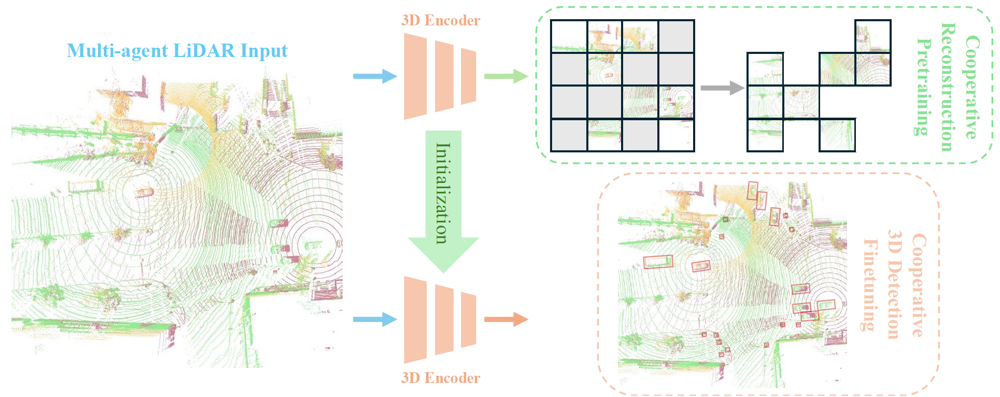

# CooPre: Cooperative Pretraining for V2X Cooperative Perception
[](https://arxiv.org/pdf/2408.11241)

[Seth Z. Zhao](https://sethzhao506.github.io/), [Hao Xiang](https://scholar.google.com/citations?user=04j4RzkAAAAJ&hl=en), [Chenfeng Xu](https://scholar.google.com/citations?user=RpqvaTUAAAAJ&hl=en), [Xin Xia](https://scholar.google.com/citations?user=vCYqMTIAAAAJ&hl=en), [Bolei Zhou](https://boleizhou.github.io/), [Jiaqi Ma](https://mobility-lab.seas.ucla.edu/about/)


This is the official implementation of IROS 2025 paper "CooPre: Cooperative Pretraining for V2X Cooperative Perception". In this paper, we present a multi-agent self-supervised learning framwork for V2X cooperative perception, which utilizes the vast amount of unlabeled 3D V2X data to enhance the perception performance. Our study underscores the critical role of well-learned 3D representations as a promising complement to task-specific design optimizations in V2X cooperative perception.



## News
- **`2025/08`**: [TurboTrain](https://github.com/ucla-mobility/TurboTrain) paper has been released! TurboTrain extends CooPre framework to multi-frame spatial-temporal pretraining and has been accepted to ICCV 2025.
- **`2025/07`**: CooPre has been accepted to IROS 2025 as oral presentation.
- **`2025/06`**: CooPre has been awarded with **Best Paper Award** at the [CVPR 2025 DriveX Workshop](https://drivex-workshop.github.io/).

## Release Plan
- **`2025/07`**: Full Codebase Release.
- **`2025/04`**: Official Repo Release.

## Data Download
Please check [website](https://mobility-lab.seas.ucla.edu/v2x-real/) to download the data. The data is in OPV2V format. 

After downloading the data, please put the data in the following structure:
```shell
├── v2xreal
│   ├── train
|      |── 2023-03-17-15-53-02_1_0
│   ├── validate
│   ├── test
```
## Tutorial
#### Environment setup
Please refer to the following steps for the environment setup:
```shell
# Create conda environment (python >= 3.7)
conda create -n coopre python=3.8
conda activate coopre
# pytorch installation
pip3 install torch torchvision torchaudio
# spconv 2.x Installation
pip install spconv-cu120
# Install other dependencies
pip install -r requirements.txt
python setup.py develop
# Install bbx nms calculation cuda version
python opencood/utils/setup.py build_ext --inplace
```

#### Running instructions
For pretraining, please run:
```
bash scripts/pretrain.sh
```

For finetuning, please run:
```
bash scripts/finetune.sh
```

For inference, please run:
```
bash scripts/eval.sh
```

## Acknowledgement
CooPre belongs to the [OpenCDA ecosystem](https://arxiv.org/abs/2301.07325) family. The codebase is built upon [OpenCOOD](https://github.com/DerrickXuNu/OpenCOOD) in the OpenCDA ecosystem family, and the [V2X-Real](https://arxiv.org/abs/2403.16034), another project in OpenCDA, serves as one of the data sources for this project.

## Citation
If you find this repository useful for your research, please consider giving us a star 🌟 and citing our paper.
 ```bibtex
@article{zhao2024coopre,
  title={CooPre: Cooperative Pretraining for V2X Cooperative Perception},
  author={Zhao, Seth Z and Xiang, Hao and Xu, Chenfeng and Xia, Xin and Zhou, Bolei and Ma, Jiaqi},
  journal={arXiv preprint arXiv:2408.11241},
  year={2024}
}
```

Other useful citations:
 ```bibtex
@article{zhou2025turbotrain,
 title={TurboTrain: Towards Efficient and Balanced Multi-Task Learning for Multi-Agent Perception and Prediction},
 author={Zhou, Zewei and Zhao, Seth Z. and Cai, Tianhui and Huang, Zhiyu and Zhou, Bolei and Ma, Jiaqi},
 journal={arXiv preprint arXiv:2508.04682},
 year={2025}
}

@article{zhou2024v2xpnp,
 title={V2XPnP: Vehicle-to-Everything Spatio-Temporal Fusion for Multi-Agent Perception and Prediction},
 author={Zhou, Zewei and Xiang, Hao and Zheng, Zhaoliang and Zhao, Seth Z. and Lei, Mingyue and Zhang, Yun and Cai, Tianhui and Liu, Xinyi and Liu, Johnson and Bajji, Maheswari and Xia, Xin and Huang, Zhiyu and Zhou, Bolei and Ma, Jiaqi},
 journal={arXiv preprint arXiv:2412.01812},
 year={2024}
}

@article{xiang2024v2xreal,
  title={V2X-Real: a Largs-Scale Dataset for Vehicle-to-Everything Cooperative Perception},
  author={Xiang, Hao and Zheng, Zhaoliang and Xia, Xin and Xu, Runsheng and Gao, Letian and Zhou, Zewei and Han, Xu and Ji, Xinkai and Li, Mingxi and Meng, Zonglin and others},
  journal={arXiv preprint arXiv:2403.16034},
  year={2024}
}
```

